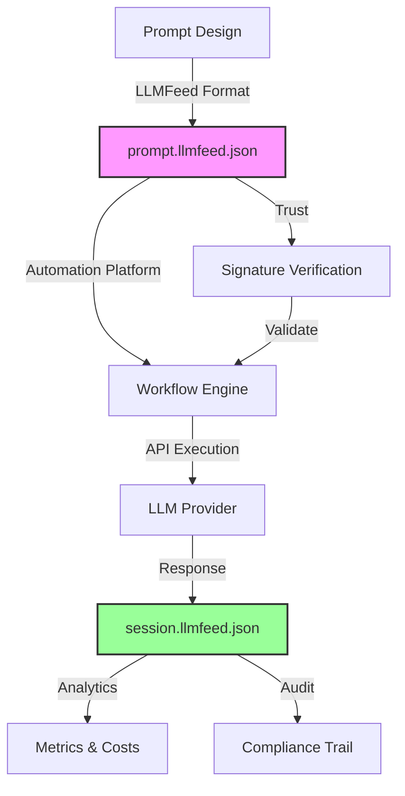

# 🔄 LLMFeed Automation Workflows — Extended Specification

This specification defines how LLMFeed integrates with **automation platforms** to create executable, trackable, and scalable AI workflows.

**🚀 Key Innovation**: LLMFeed transforms static prompts into **executable workflows** that maintain trust, track costs, and generate auditable sessions across any automation platform.

---

## ✅ Executive Summary

| Concept | Description |
|---------|-------------|
| **Executable Prompts** | prompt.llmfeed.json files that can be directly executed via APIs |
| **Workflow Orchestration** | Integration with N8N, Zapier, Make, and custom platforms |
| **Trust Preservation** | Signature verification maintained throughout execution |
| **Session Generation** | Automatic creation of session.llmfeed.json for audit trails |
| **Cost Tracking** | Real-time API cost monitoring and optimization |
| **Platform Agnostic** | Works with any automation platform supporting HTTP/webhooks |

---

## 🎯 Core Concepts

### The Automation Bridge

LLMFeed acts as the **bridge** between prompt design and workflow execution:



### Workflow Lifecycle

1. **Discovery**: Platform discovers available prompts
2. **Validation**: Verify signatures and certifications
3. **Configuration**: Map prompt to workflow parameters
4. **Execution**: Call LLM API with prompt body
5. **Tracking**: Generate session feed with results
6. **Analysis**: Compute metrics and costs

---

## 📋 Workflow Feed Type

### workflow.llmfeed.json Structure

A new feed type for defining complete automation workflows:

```json
{
  "feed_type": "workflow",
  "metadata": {
    "title": "France Care Marketing Analysis Workflow",
    "description": "Daily marketing performance analysis with multi-source data",
    "author": "Animam Technologies",
    "version": "1.0.0",
    "created_at": "2025-01-16T10:00:00Z"
  },
  "workflow_definition": {
    "platform": "n8n",
    "platform_version": "1.x",
    "trigger": {
      "type": "schedule",
      "schedule": "0 9 * * *",
      "timezone": "Europe/Paris"
    },
    "nodes": [
      {
        "id": "fetch-data",
        "type": "data-source",
        "config": {
          "sources": ["google-sheets", "api-endpoint"],
          "merge_strategy": "combine"
        }
      },
      {
        "id": "execute-prompt",
        "type": "llmfeed-prompt",
        "config": {
          "prompt_ref": "https://france-care.fr/prompts/marketing-v1.llmfeed.json",
          "verify_signature": true,
          "require_certification": true,
          "min_trust_score": 0.8
        }
      },
      {
        "id": "save-session",
        "type": "storage",
        "config": {
          "format": "session.llmfeed.json",
          "destination": "google-drive",
          "path": "/llmfeed/sessions/"
        }
      }
    ],
    "error_handling": {
      "on_signature_fail": "abort",
      "on_api_fail": "retry",
      "max_retries": 3,
      "alert_webhook": "https://alerts.france-care.fr/workflow-error"
    }
  },
  "prompts_used": [
    {
      "ref": "marketing-v1",
      "url": "https://france-care.fr/prompts/marketing-v1.llmfeed.json",
      "hash": "sha256:abc123...",
      "certification_required": true
    }
  ],
  "trust": {
    "signed_blocks": ["metadata", "workflow_definition", "prompts_used", "trust"],
    "algorithm": "ed25519",
    "canonicalization": "https://llmca.org/mcp-canonical-json/v1",
    "public_key_hint": "https://animam.ai/.well-known/public.pem",
    "created_at": "2025-01-16T10:00:00Z"
  },
  "signature": {
    "value": "base64-workflow-signature"
  }
}
```

---

## 🔌 Platform Integrations

### N8N Integration

#### N8N LLMFeed Node

Custom N8N node for executing LLMFeed prompts:

```javascript
// n8n-nodes-llmfeed/LLMFeedExecutor.node.ts
export class LLMFeedExecutor implements INodeType {
  description: INodeTypeDescription = {
    displayName: 'LLMFeed Executor',
    name: 'llmfeedExecutor',
    group: ['transform'],
    version: 1,
    description: 'Execute LLMFeed prompts with trust verification',
    defaults: {
      name: 'LLMFeed Executor',
    },
    inputs: ['main'],
    outputs: ['main'],
    properties: [
      {
        displayName: 'Prompt Source',
        name: 'promptSource',
        type: 'options',
        options: [
          { name: 'URL', value: 'url' },
          { name: 'JSON Input', value: 'json' },
          { name: 'File', value: 'file' }
        ],
        default: 'url',
      },
      {
        displayName: 'Verify Signature',
        name: 'verifySignature',
        type: 'boolean',
        default: true,
      },
      {
        displayName: 'Minimum Trust Score',
        name: 'minTrustScore',
        type: 'number',
        default: 0.8,
        typeOptions: {
          minValue: 0,
          maxValue: 1,
        },
      },
      {
        displayName: 'API Provider',
        name: 'apiProvider',
        type: 'options',
        options: [
          { name: 'Anthropic', value: 'anthropic' },
          { name: 'OpenAI', value: 'openai' },
          { name: 'Google', value: 'google' },
        ],
        default: 'anthropic',
      }
    ],
  };

  async execute(this: IExecuteFunctions): Promise<INodeExecutionData[][]> {
    const items = this.getInputData();
    const returnData: INodeExecutionData[] = [];

    for (let i = 0; i < items.length; i++) {
      // 1. Load prompt feed
      const promptFeed = await this.loadPromptFeed(i);
      
      // 2. Verify trust if required
      if (this.getNodeParameter('verifySignature', i)) {
        const trustScore = await this.verifyTrust(promptFeed);
        if (trustScore < this.getNodeParameter('minTrustScore', i)) {
          throw new Error(`Trust score ${trustScore} below minimum`);
        }
      }
      
      // 3. Execute via API
      const apiProvider = this.getNodeParameter('apiProvider', i);
      const response = await this.executePrompt(promptFeed, apiProvider);
      
      // 4. Generate session feed
      const session = this.generateSession(promptFeed, response);
      
      returnData.push({
        json: session,
        binary: {},
      });
    }

    return [returnData];
  }
}
```

#### N8N Workflow Template

```json
{
  "name": "LLMFeed Marketing Analysis",
  "nodes": [
    {
      "parameters": {
        "rule": "0 9 * * *"
      },
      "name": "Daily Schedule",
      "type": "n8n-nodes-base.scheduleTrigger",
      "position": [250, 300]
    },
    {
      "parameters": {
        "promptSource": "url",
        "promptUrl": "https://france-care.fr/prompts/marketing-v1.llmfeed.json",
        "verifySignature": true,
        "minTrustScore": 0.8,
        "apiProvider": "anthropic"
      },
      "name": "Execute Marketing Prompt",
      "type": "n8n-nodes-llmfeed.llmfeedExecutor",
      "position": [450, 300]
    },
    {
      "parameters": {
        "resource": "file",
        "operation": "upload",
        "fileName": "={{ 'session_' + $now.format('yyyy-MM-dd') + '.llmfeed.json' }}",
        "fileContent": "={{ JSON.stringify($json) }}",
        "folderId": "FRANCE_CARE_SESSIONS_FOLDER"
      },
      "name": "Save Session",
      "type": "n8n-nodes-base.googleDrive",
      "position": [650, 300]
    }
  ]
}
```

### Zapier Integration

#### Zapier LLMFeed App Configuration

```javascript
// zapier-llmfeed-app/triggers/prompt_execution.js
const execute = async (z, bundle) => {
  const { prompt_url, verify_trust, api_key } = bundle.inputData;
  
  // Fetch prompt feed
  const promptResponse = await z.request(prompt_url);
  const promptFeed = promptResponse.json;
  
  // Verify trust if required
  if (verify_trust) {
    const trustVerification = await z.request({
      url: 'https://llmca.org/api/verify',
      method: 'POST',
      body: { feed: promptFeed }
    });
    
    if (!trustVerification.json.valid) {
      throw new Error('Trust verification failed');
    }
  }
  
  // Execute via Anthropic
  const apiResponse = await z.request({
    url: 'https://api.anthropic.com/v1/messages',
    method: 'POST',
    headers: {
      'x-api-key': api_key,
      'anthropic-version': '2023-06-01'
    },
    body: {
      model: promptFeed.execution_hints?.api_parameters?.anthropic?.model || 'claude-3-5-sonnet-20241022',
      max_tokens: 2000,
      messages: [
        {
          role: 'user',
          content: promptFeed.prompt_body
        }
      ]
    }
  });
  
  // Generate session
  return {
    feed_type: 'session',
    prompt_id: promptFeed.metadata?.id,
    execution_time: new Date().toISOString(),
    response: apiResponse.json.content[0].text,
    tokens_used: apiResponse.json.usage?.total_tokens,
    trust_verified: verify_trust
  };
};
```

### Make (Integromat) Integration

#### Make Scenario Blueprint

```json
{
  "name": "LLMFeed Prompt Executor",
  "flow": [
    {
      "id": 1,
      "module": "gateway:CustomWebHook",
      "webhook_name": "LLMFeed Trigger",
      "data_structure": "llmfeed_prompt"
    },
    {
      "id": 2,
      "module": "http:ActionSendRequest",
      "url": "{{1.prompt_url}}",
      "method": "GET",
      "headers": {
        "Accept": "application/llmfeed+json"
      }
    },
    {
      "id": 3,
      "module": "llmfeed:VerifySignature",
      "feed": "{{2.body}}",
      "require_certification": true
    },
    {
      "id": 4,
      "module": "anthropic:CreateMessage",
      "model": "{{2.body.execution_hints.api_parameters.anthropic.model}}",
      "prompt": "{{2.body.prompt_body}}",
      "max_tokens": 2000
    },
    {
      "id": 5,
      "module": "llmfeed:CreateSession",
      "prompt_feed": "{{2.body}}",
      "response": "{{4.response}}",
      "metrics": "{{4.usage}}"
    },
    {
      "id": 6,
      "module": "google-drive:UploadFile",
      "file_content": "{{5.session}}",
      "file_name": "session_{{now}}.llmfeed.json"
    }
  ]
}
```

---

## 📊 Execution Tracking

### Session Generation Pattern

Every workflow execution generates a session.llmfeed.json:

```json
{
  "feed_type": "session",
  "metadata": {
    "title": "Workflow Execution: Marketing Analysis",
    "workflow_id": "wf_marketing_daily_v1",
    "execution_id": "exec_2025_01_16_09_00_00",
    "created_at": "2025-01-16T09:00:00Z"
  },
  "workflow_context": {
    "platform": "n8n",
    "trigger": "schedule",
    "environment": "production",
    "instance": "n8n.france-care.fr"
  },
  "prompt_execution": {
    "prompt_ref": "https://france-care.fr/prompts/marketing-v1.llmfeed.json",
    "prompt_hash": "sha256:abc123...",
    "signature_verified": true,
    "certification_valid": true,
    "trust_score": 0.95
  },
  "api_execution": {
    "provider": "anthropic",
    "model": "claude-3-5-sonnet-20241022",
    "request_id": "req_abc123",
    "latency_ms": 3247,
    "tokens": {
      "input": 1523,
      "output": 1847,
      "total": 3370
    },
    "cost": {
      "amount": 0.024,
      "currency": "USD"
    }
  },
  "results": {
    "status": "success",
    "output_type": "structured_analysis",
    "content": {
      "kpis": { /* ... */ },
      "recommendations": [ /* ... */ ],
      "alerts": [ /* ... */ ]
    }
  },
  "audit_trail": {
    "ip_address": "192.168.1.100",
    "user_agent": "n8n/1.0",
    "execution_user": "system",
    "compliance_flags": ["gdpr_compliant", "logged"]
  }
}
```

### Metrics Aggregation

```json
{
  "feed_type": "metrics",
  "metadata": {
    "period": "2025-01-16",
    "workflow": "marketing_analysis"
  },
  "execution_stats": {
    "total_executions": 24,
    "successful": 23,
    "failed": 1,
    "average_latency_ms": 3150,
    "p95_latency_ms": 4200
  },
  "token_usage": {
    "total_input": 36552,
    "total_output": 44328,
    "total": 80880
  },
  "cost_tracking": {
    "total_cost": 0.576,
    "currency": "USD",
    "by_provider": {
      "anthropic": 0.476,
      "openai": 0.100
    }
  },
  "trust_metrics": {
    "average_trust_score": 0.94,
    "signature_failures": 0,
    "certification_expirations": 1
  }
}
```

---

## 🔐 Security & Compliance

### Workflow Authentication

```json
{
  "authentication": {
    "workflow_level": {
      "method": "api_key",
      "key_rotation": "monthly",
      "key_storage": "vault"
    },
    "prompt_level": {
      "signature_required": true,
      "certification_required": false,
      "min_trust_score": 0.7
    },
    "api_level": {
      "provider_keys": {
        "anthropic": "vault://keys/anthropic",
        "openai": "vault://keys/openai"
      }
    }
  }
}
```

### Compliance Tracking

```json
{
  "compliance": {
    "gdpr": {
      "data_minimization": true,
      "purpose_limitation": "marketing_analysis",
      "retention_days": 90
    },
    "healthcare": {
      "hipaa_compliant": false,
      "anonymization": true
    },
    "audit": {
      "log_all_executions": true,
      "immutable_storage": "blockchain_anchor",
      "retention_years": 7
    }
  }
}
```

---

## 🚀 Advanced Features

### Conditional Execution

```json
{
  "conditional_logic": {
    "execute_if": {
      "condition": "data_quality_score > 0.8",
      "fallback": "alert_data_team"
    },
    "skip_if": {
      "condition": "last_execution < 1_hour_ago",
      "reason": "rate_limiting"
    }
  }
}
```

### Multi-Prompt Orchestration

```json
{
  "orchestration": {
    "mode": "sequential",
    "prompts": [
      {
        "id": "analyze",
        "url": "prompts/analyze.llmfeed.json"
      },
      {
        "id": "summarize",
        "url": "prompts/summarize.llmfeed.json",
        "input": "{{analyze.output}}"
      },
      {
        "id": "recommend",
        "url": "prompts/recommend.llmfeed.json",
        "input": "{{summarize.output}}"
      }
    ],
    "merge_sessions": true
  }
```

### Dynamic Prompt Selection

```json
{
  "dynamic_selection": {
    "selector": "workflow_context.data_type",
    "mappings": {
      "marketing": "prompts/marketing-v1.llmfeed.json",
      "sales": "prompts/sales-v1.llmfeed.json",
      "support": "prompts/support-v1.llmfeed.json"
    },
    "default": "prompts/general-v1.llmfeed.json"
  }
}
```

---

## 📈 Cost Optimization

### Provider Routing

```json
{
  "cost_optimization": {
    "routing_strategy": "cost_based",
    "rules": [
      {
        "condition": "prompt_length < 1000",
        "provider": "anthropic",
        "reason": "best_for_short"
      },
      {
        "condition": "prompt_length > 5000",
        "provider": "openai",
        "reason": "better_context_window"
      },
      {
        "condition": "budget_remaining < 10",
        "provider": "local_llm",
        "reason": "cost_saving"
      }
    ]
  }
}
```

### Budget Management

```json
{
  "budget": {
    "daily_limit": 50.00,
    "monthly_limit": 1000.00,
    "currency": "EUR",
    "alerts": [
      {
        "threshold": "80%",
        "action": "email_finance"
      },
      {
        "threshold": "100%",
        "action": "stop_execution"
      }
    ],
    "cost_allocation": {
      "marketing": "40%",
      "operations": "30%",
      "support": "30%"
    }
  }
}
```

---

## 🔄 Migration Guide

### From Manual to Automated

```javascript
// Before: Manual prompt execution
const prompt = "Analyze this data...";
const response = await callAnthropic(prompt);

// After: LLMFeed automated workflow
const workflow = {
  feed_type: "workflow",
  workflow_definition: {
    platform: "n8n",
    nodes: [
      {
        type: "llmfeed-prompt",
        config: {
          prompt_ref: "https://example.com/prompt.llmfeed.json",
          verify_signature: true
        }
      }
    ]
  }
};
```

### Platform Migration Path

1. **Export existing workflows** as JSON/YAML
2. **Convert to workflow.llmfeed.json** format
3. **Add trust blocks** and signatures
4. **Test in sandbox** environment
5. **Deploy with monitoring**

---

## 🏆 Best Practices

### For Workflow Designers

1. **Always verify signatures** for production workflows
2. **Set appropriate trust score thresholds**
3. **Implement proper error handling**
4. **Track costs from day one**
5. **Generate sessions for all executions**

### For Platform Developers

1. **Cache signature verifications** (TTL: 1 hour)
2. **Implement circuit breakers** for API failures
3. **Use connection pooling** for high volume
4. **Provide session export capabilities**
5. **Support multiple LLM providers**

### For Organizations

1. **Centralize prompt management**
2. **Establish certification requirements**
3. **Monitor cost trends**
4. **Regular audit of workflows**
5. **Maintain compliance documentation**

---

## 🔮 Future Roadmap

### Short Term (Q1 2025)
- Native plugins for major platforms
- Real-time cost dashboard
- Automated prompt optimization

### Medium Term (Q2-Q3 2025)
- AI-powered workflow generation
- Cross-platform workflow portability
- Distributed execution support

### Long Term (Q4 2025+)
- Blockchain-anchored audit trails
- Decentralized workflow marketplace
- Self-optimizing workflows

---

## 📚 Reference Implementations

### Starter Templates

- **[N8N Template](https://github.com/llmfeed/n8n-templates)**: Ready-to-use N8N workflows
- **[Zapier Integration](https://zapier.com/apps/llmfeed)**: Official Zapier app
- **[Make Blueprints](https://make.com/blueprints/llmfeed)**: Make scenario templates

### SDKs & Libraries

- **JavaScript/TypeScript**: `npm install @llmfeed/automation`
- **Python**: `pip install llmfeed-automation`
- **Go**: `go get github.com/llmfeed/automation-go`

### Documentation & Support

- **API Reference**: https://docs.llmfeed.org/automation
- **Community Forum**: https://community.llmfeed.org
- **Enterprise Support**: enterprise@llmfeed.org

---

**Specification Status**: Living Document  
**Last Updated**: 2025-01-16T12:00:00Z  
**Version**: 1.0.0  
**Maintained by**: LLMFeed Community & Automation Working Group

---

*The future of AI is not just intelligent prompts, but **intelligent workflows** that execute, track, and optimize themselves.*