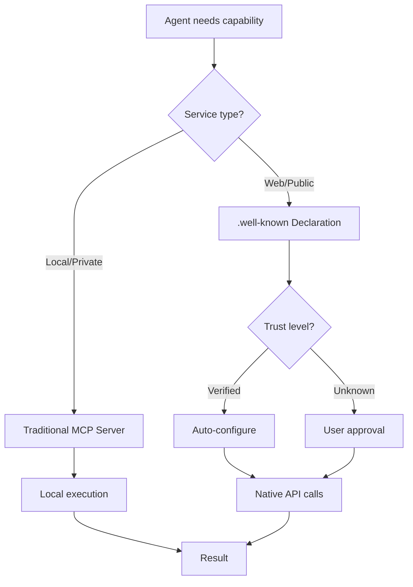

# 🤖 Auto-Configuration & MCP Server Evolution

## The revolutionary shift from manual MCP setup to autonomous agent configuration via .well-known standards

---

## 🎯 The Central Question

> **Are traditional MCP servers still relevant when websites can declaratively expose their capabilities, APIs, and interaction patterns through .well-known feeds?**

This document explores the evolution from discrete MCP server installations to a decentralized ecosystem of self-describing, auto-configurable web services.

---

## 🌐 The .well-known/mcp.llmfeed.json Revolution

### Current State: Manual MCP Configuration
```bash
# Today's workflow
1. Discover a service needs MCP integration
2. Find or build the MCP server
3. Download and install locally
4. Configure connection parameters
5. Restart Claude with new config
6. Debug inevitable issues
7. Maintain and update manually
```

### Future Vision: Auto-Discovery & Configuration
```bash
# Tomorrow's workflow
1. "Claude, configure yourself with services from example.com"
2. Agent discovers /.well-known/mcp.llmfeed.json
3. Validates cryptographic signatures
4. Auto-configures capabilities
5. ✅ Ready to use immediately
```

---

## 🏗️ Complete Compatibility Architecture

### The Genius: Total Backward Compatibility

```json
// example.com/.well-known/mcp.llmfeed.json
{
  "feed_type": "mcp_server_declaration",
  "metadata": {
    "title": "Example.com Services",
    "description": "Complete API integration with native capabilities",
    "llm_intent": "Auto-configure these MCP services for seamless integration"
  },

  // ✅ EXACT SAME as traditional MCP config
  "mcp_servers": {
    "example-geolocation": {
      "command": "npx",
      "args": ["@example/geo-mcp-server"],
      "env": {
        "EXAMPLE_API_KEY": "${EXAMPLE_API_KEY}",
        "EXAMPLE_ENDPOINT": "https://api.example.com/geo"
      }
    }
  },

  // 🚀 ENHANCED with native web capabilities
  "api_endpoints": {
    "geolocation": {
      "url": "https://api.example.com/geo",
      "method": "POST",
      "authentication": "bearer_token",
      "capabilities": ["location_search", "reverse_geocoding", "nearby_places"]
    }
  },

  "interaction_prompts": [
    "Find restaurants near [location]",
    "Get weather for [place]",
    "Navigate from [A] to [B]"
  ],

  "agent_intents": ["location_services", "mapping", "local_search"],

  "trust": {
    "signed_blocks": ["mcp_servers", "api_endpoints", "metadata"],
    "algorithm": "ed25519",
    "signature": "...",
    "certifier": "https://llmca.org"
  }
}
```

**Key Innovation**: Traditional MCP servers work unchanged, but enhanced with native web integration and cryptographic trust.

---

## 📈 Progressive Integration Roadmap

### Phase 1: Discovery & Guided Configuration (Current)
**Agent Capability:** Detection and guidance
```json
// Agent behavior
{
  "discovery": "Agent scans .well-known/mcp.llmfeed.json",
  "analysis": "Identifies available MCP services and native APIs",
  "user_interaction": "Hey, on example.com I found geolocation MCP services. I can't configure automatically yet, but here's how to add them to your MCP config...",
  "configuration": "manual_with_intelligent_guidance"
}
```

### Phase 2: Assisted Configuration (Near Future)
**Enhanced with cryptographic trust and user approval:**
```json
// Agent behavior
{
  "discovery": "Automatic .well-known scanning",
  "verification": "Ed25519 signature validation",
  "user_interaction": "example.com is LLMCA-certified trusted. I can help you configure OAuth with your GitHub credentials and set up the MCP connection. Shall I proceed?",
  "configuration": "assisted_setup_with_crypto_trust"
}
```

### Phase 3: Autonomous Trust & Configuration (Future)
**Full autonomy with verified trust infrastructure:**
```json
// Agent behavior
{
  "discovery": "Continuous .well-known monitoring",
  "verification": "Automatic signature + certification validation",
  "authorization": "User-delegated permissions for trusted domains",
  "user_interaction": "Automatically configured geolocation MCP from trusted example.com. New capabilities available: local search, weather, mapping. Review audit log?",
  "configuration": "zero_friction_autonomous_setup"
}
```

---

## 🤔 MCP Servers vs Declarative Feeds: The Evolution

### Traditional MCP Servers: Still Valuable
**Strengths:**
- ✅ **Deep Integration**: Complex business logic and stateful operations
- ✅ **Performance**: Local execution, no network latency
- ✅ **Privacy**: Sensitive operations stay local
- ✅ **Existing Ecosystem**: Anthropic MCP infrastructure proven

**Use Cases:**
- File system operations
- Local development tools
- Enterprise internal services
- Privacy-sensitive workflows

### Declarative .well-known Feeds: Revolutionary
**Strengths:**
- ✅ **Zero Installation**: No local server required
- ✅ **Universal Discovery**: Any agent can find any service
- ✅ **Cryptographic Trust**: Signatures prevent spoofing
- ✅ **Web-Scale**: Works across the entire internet
- ✅ **Real-Time**: Always current, no version conflicts

**Use Cases:**
- Public API integration
- Web service discovery
- Cross-platform capabilities
- Autonomous agent workflows

### The Hybrid Future
**Not Either/Or — Both/And:**



---

## 🌍 The Decentralized MCP Repository Vision

### .well-known as Universal MCP Registry

Instead of centralized package managers, every website becomes its own MCP publisher:

```bash
# Discovery becomes universal
https://github.com/.well-known/mcp.llmfeed.json     # Code collaboration
https://stripe.com/.well-known/mcp.llmfeed.json     # Payment processing
https://maps.google.com/.well-known/mcp.llmfeed.json # Mapping services
https://openai.com/.well-known/mcp.llmfeed.json     # AI services
```

**Network Effects:**
- Every new site = new capabilities for every agent
- Cryptographic trust scales horizontally
- No single point of failure or control
- Market-driven quality and innovation

### Obsolescence Question: When Are Traditional Servers Unnecessary?

**Scenarios where .well-known feeds replace MCP servers entirely:**

1. **Pure API Wrappers**: If MCP server just calls web APIs
2. **Simple CRUD Operations**: Standard REST/GraphQL patterns
3. **Stateless Services**: No local state or complex logic needed
4. **Discovery-First**: When discoverability is more valuable than performance

**Scenarios where traditional MCP servers remain essential:**

1. **Local Resources**: File systems, databases, development tools
2. **Privacy-Critical**: Data that cannot leave local environment
3. **Complex Logic**: Multi-step workflows with business rules
4. **Performance-Sensitive**: Real-time or high-throughput operations

---

## 🔐 Trust Infrastructure: The LLMCA Foundation

### Cryptographic Trust Chain
```json
{
  "trust_hierarchy": {
    "level_1": "Self-signed declarations (low trust)",
    "level_2": "Domain validation (medium trust)",
    "level_3": "LLMCA certification (high trust)",
    "level_4": "Enterprise certification (highest trust)"
  },

  "agent_behavior_by_trust_level": {
    "level_1": "Require explicit user approval",
    "level_2": "Warn user, allow with consent",
    "level_3": "Auto-configure with user notification",
    "level_4": "Full autonomous configuration"
  }
}
```

### Signature Verification Process
```typescript
const verifyMCPFeed = async (feedUrl: string) => {
  const feed = await fetch(feedUrl);
  const publicKey = await fetch(feed.trust.public_key_hint);

  // Verify signature
  const isValid = await ed25519.verify(
    feed.signature.value,
    canonicalize(feed.signed_blocks),
    publicKey
  );

  // Check certification
  const isCertified = await llmca.verifyCertification(feed);

  return {
    signature_valid: isValid,
    certified: isCertified,
    trust_level: calculateTrustLevel(isValid, isCertified),
    safe_for_auto_config: isValid && isCertified
  };
};
```

---

## 🚀 Implementation Strategy

### For Developers: Dual-Path Approach
```bash
# Phase 1: Enhance existing MCP servers
1. Keep your traditional MCP server working
2. Create .well-known/mcp.llmfeed.json with same config
3. Add metadata, capabilities, intents
4. Test auto-discovery flow

# Phase 2: Native web integration
1. Add direct API endpoint declarations
2. Include interaction prompts and agent guidance
3. Apply for LLMCA certification
4. Enable autonomous agent access
```

### For Enterprises: Risk-Managed Adoption
```json
{
  "adoption_strategy": {
    "internal_services": "Traditional MCP servers (security)",
    "public_integrations": ".well-known declarations (discovery)",
    "hybrid_approach": "Both for maximum flexibility",
    "trust_policy": "LLMCA-certified only for auto-config"
  }
}
```

### For Agent Developers: Intelligent Orchestration
```typescript
const intelligentMCPOrchestration = async (capability: string) => {
  // 1. Check local MCP servers first
  const localServers = await scanLocalMCPServers(capability);
  if (localServers.length > 0) return localServers;

  // 2. Discover web services via .well-known
  const webServices = await discoverWebServices(capability);
  const trustedServices = webServices.filter(s => s.trust_level >= 3);

  // 3. Present options to user or auto-configure based on trust
  return intelligentSelection(localServers, trustedServices);
};
```

---

## 🎯 The Ultimate Vision: Agent-Native Web

By 2027, we envision:

### **Universal Service Discovery**
- Every website publishes its agent capabilities
- Agents autonomously discover and integrate services
- Trust infrastructure enables safe auto-configuration
- Network effects drive ubiquitous adoption

### **Hybrid Architecture Dominance**
- Traditional MCP servers for local/private operations
- .well-known declarations for web-scale discovery
- Intelligent agents orchestrate both seamlessly
- Users experience zero-friction capability access

### **Market Transformation**
- Service quality driven by agent adoption metrics
- Cryptographic trust becomes competitive advantage
- Interoperability replaces platform lock-in
- Innovation accelerates through frictionless integration

---

## 🤝 Call to Action

**The transformation has begun.**

Traditional MCP servers aren't obsolete—they're evolving into part of a larger, more powerful ecosystem where local capabilities and web services work together seamlessly.

**For developers:** Start publishing your .well-known/mcp.llmfeed.json today
**For enterprises:** Pilot the hybrid approach with trusted services
**For agent builders:** Implement intelligent orchestration between local and web capabilities

**The agent-native web is coming. The question isn't whether to adopt—it's whether to lead or follow.**

---

## 📚 Related Documentation

- **[Progressive Integration Roadmap](./roadmap-progressive-integration.md)**: Implementation timeline and technical levels
- **[Token Economics Vision](./token-economics-vision.md)**: Efficiency gains and optimization strategies
- **[LLM Training & Validation](./llm-training-validation-ecosystem.md)**: Agent training and capability validation

---

*The future isn't MCP servers OR .well-known feeds—it's both, working together in an intelligent, trust-verified, auto-configuring ecosystem that makes every agent more capable and every service more discoverable.*