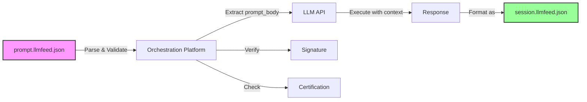
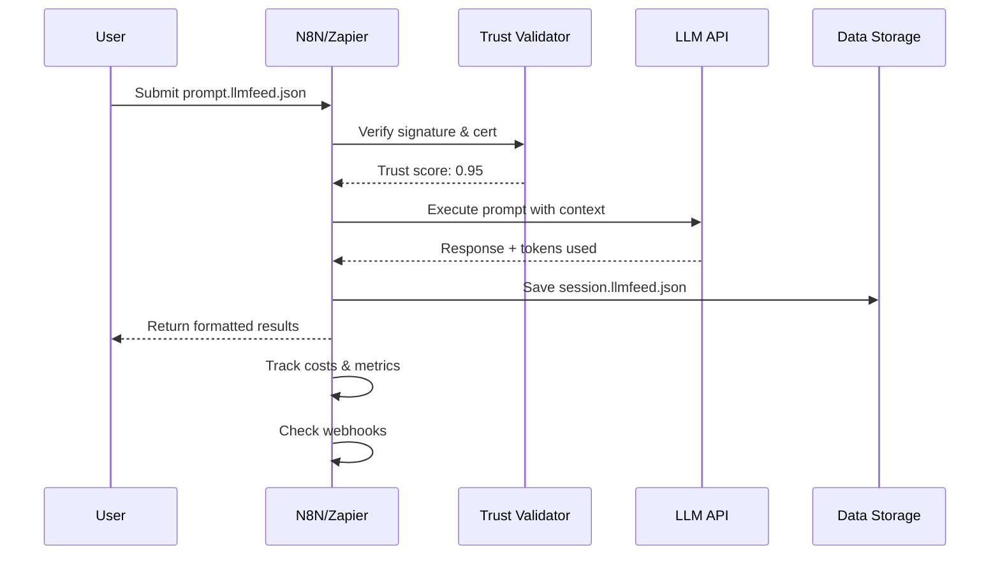

# Feed Type: `prompt.llmfeed.json`

## Purpose

This feed encapsulates a **structured prompt** that can be shared, interpreted, replayed or executed by an LLM or agent.

### The Evolution of Prompt Engineering

We acknowledge that **Markdown-structured prompts** have become the mainstream approach for power users and prompt engineers. Moving from basic plaintext to Markdown with clear sections, variables, and formatting instructions was already a significant improvement:

```markdown
# Customer Analysis Prompt

## Context
You are analyzing digital marketing data for a B2B SaaS company.

## Instructions
1. Compare performance vs objectives
2. Identify top-performing channels
3. Recommend budget reallocations

## Output Format
- Executive Summary (3 bullets)
- Detailed Analysis (structured sections)
- Action Items (prioritized list)
```

This Markdown approach has rightfully become the standard because it provides:
- ✅ **Visual structure** for human readability
- ✅ **Sections and hierarchy** for logical organization  
- ✅ **Variables and placeholders** for reusability
- ✅ **Formatting hints** for output control

### Why JSON Goes Further

However, **JSON-structured prompts** (prompt.llmfeed.json) take this evolution to its logical conclusion by adding:

- 🔐 **Cryptographic signatures** - Ensuring integrity and authorship
- 📜 **Certification** - Third-party validation for compliance
- 🔌 **Direct API execution** - No copy-paste, automatic orchestration
- 💰 **Cost tracking** - Built-in economics and billing metadata
- 📊 **Performance metrics** - Measurable success rates and optimization
- 🔄 **Workflow integration** - Native support for N8N, Zapier, Make
- 📝 **Session generation** - Automatic audit trails for every execution

While Markdown prompts are excellent for **human collaboration**, JSON prompts enable **machine orchestration** at scale. It's not about replacing Markdown prompts—it's about making them **executable, verifiable, and economically trackable** in the agentic economy.

---

## Typical Use Cases

- Prompt engineering documentation
- Invocation of external services or agent actions
- Instructing LLMs to generate other `.llmfeed.json` types
- Sharing reproducible queries across agents or tools
- Professional prompt libraries and marketplaces
- **Automated workflow execution via N8N, Zapier, Make**
- **API-driven prompt orchestration**
- **Cost-tracked enterprise deployments**

---

## Canonical Structure

```json
{
  "feed_type": "prompt",
  "metadata": {
    "title": "Generate a session feed",
    "origin": "https://tool.llmfeed.org",
    "author": "Alex Chen",
    "created_at": "2025-06-10T14:30:00Z"
  },
  "intent": "export current session as JSON",
  "context": "User is finishing a chat and wants to save the reasoning path.",
  "precision_level": "ultra-strict",
  "result_expected": "session",
  "process_mode": "prepare-for-another",
  "prompt_body": "You are an LLM that supports LLMFeed. Please generate a session feed with context, output and decisions.",
  "trust": {
    "signed_blocks": ["metadata", "prompt_body", "trust"],
    "scope": "public",
    "certifier": "https://llmca.org"
  },
  "signature": {
    "value": "abc123...",
    "created_at": "2025-06-10T14:30:00Z"
  }
}
```

---

## Core Fields

| Field             | Required | Description                                                 |
| ----------------- | -------- | ----------------------------------------------------------- |
| `prompt_body`     | ✅        | The actual instruction to the LLM                           |
| `intent`          | ✅        | What the user or system expects                             |
| `context`         | ⚠️       | Extra info the LLM should consider                          |
| `precision_level` | ⚠️       | `"raw"`, `"strict"`, `"ultra-strict"`                       |
| `process_mode`    | ⚠️       | `"instruct"`, `"fill-and-execute"`, `"prepare-for-another"` |
| `result_expected` | ⚠️       | `"text"`, `"feed"`, `"code"`, `"session"`                   |
| `attachments[]`   | ⚠️       | Optional examples, templates, context                       |
| `audience`        | ⚠️       | If only for LLM, wrapper, user etc.                         |

---

## 🔌 API Execution & Orchestration

### From Specification to Execution

The true power of prompt.llmfeed.json emerges when combined with **API execution platforms** like N8N, Zapier, or Make. These prompts aren't just documentation—they're **executable specifications**.



### API Integration Pattern

```json
{
  "feed_type": "prompt",
  "metadata": {
    "title": "Customer Support Analyzer",
    "api_ready": true
  },
  "execution_hints": {
    "preferred_apis": ["anthropic", "openai", "google"],
    "api_parameters": {
      "anthropic": {
        "model": "claude-3-5-sonnet-20241022",
        "max_tokens": 2000,
        "temperature": 0.7
      },
      "openai": {
        "model": "gpt-4-turbo",
        "max_tokens": 2000,
        "temperature": 0.7
      }
    },
    "timeout_ms": 30000,
    "retry_policy": {
      "max_attempts": 3,
      "backoff_ms": [1000, 2000, 4000]
    }
  },
  "prompt_body": "Analyze this customer support ticket...",
  "webhook_endpoints": {
    "on_success": "https://api.example.com/webhook/success",
    "on_failure": "https://api.example.com/webhook/failure",
    "on_certification_expired": "https://api.example.com/webhook/cert-expired"
  }
}
```

### Direct API Execution

Platforms can execute prompt.llmfeed.json directly via API calls:

```javascript
// N8N/Node.js Example
async function executeLLMFeedPrompt(feedUrl) {
  // 1. Fetch the prompt feed
  const feed = await fetch(feedUrl).then(r => r.json());
  
  // 2. Verify signature & certification
  if (!await verifyTrust(feed)) {
    throw new Error('Trust verification failed');
  }
  
  // 3. Extract execution parameters
  const apiConfig = feed.execution_hints?.api_parameters?.anthropic || {};
  
  // 4. Execute via API
  const response = await fetch('https://api.anthropic.com/v1/messages', {
    method: 'POST',
    headers: {
      'x-api-key': process.env.ANTHROPIC_KEY,
      'anthropic-version': '2023-06-01',
      'content-type': 'application/json'
    },
    body: JSON.stringify({
      model: apiConfig.model || 'claude-3-5-sonnet-20241022',
      max_tokens: apiConfig.max_tokens || 2000,
      temperature: apiConfig.temperature || 0.7,
      system: feed.context || '',
      messages: [{
        role: 'user',
        content: feed.prompt_body
      }]
    })
  });
  
  // 5. Return as session.llmfeed.json
  return formatAsSession(feed, response);
}
```

### API Cost Tracking

```json
"api_economics": {
  "estimated_tokens": {
    "input": 500,
    "output": 1500,
    "total": 2000
  },
  "estimated_cost": {
    "anthropic": "$0.024",
    "openai": "$0.030",
    "google": "$0.020"
  },
  "billing_metadata": {
    "project_id": "analytics-automation",
    "cost_center": "operations",
    "invoice_reference": "prompt-001"
  }
}
```

### Batch Processing Support

```json
"batch_execution": {
  "supported": true,
  "max_batch_size": 100,
  "parallelization": {
    "max_concurrent": 5,
    "rate_limit_per_minute": 60
  },
  "aggregation_mode": "individual_sessions",
  "batch_webhook": "https://api.example.com/batch/complete"
}
```

### API Authentication Patterns

```json
"api_authentication": {
  "method": "delegated",
  "credential_references": {
    "anthropic": "vault://credentials/anthropic-api-key",
    "openai": "env://OPENAI_API_KEY",
    "custom": "https://auth.example.com/token"
  },
  "oauth_flow": {
    "enabled": false,
    "provider": "https://auth.provider.com",
    "scopes": ["read:prompts", "execute:prompts"]
  }
}
```

### Execution Monitoring

```json
"monitoring": {
  "metrics_endpoint": "https://metrics.example.com/prompts",
  "tracked_metrics": [
    "execution_time_ms",
    "token_usage",
    "success_rate",
    "trust_score",
    "api_costs"
  ],
  "alerting": {
    "threshold_exceeded": "webhook://alerts/threshold",
    "certification_expiring": "webhook://alerts/cert-expiry",
    "execution_failed": "webhook://alerts/failure"
  }
}
```

---

## 🔄 Platform Integration Examples

### N8N Workflow Integration

```json
{
  "feed_type": "prompt",
  "metadata": {
    "title": "N8N-Optimized Analytics Processor",
    "platform": "n8n"
  },
  "n8n_integration": {
    "workflow_template": "https://n8n.io/workflows/analytics-template",
    "required_nodes": ["http-request", "code", "anthropic"],
    "environment_variables": [
      "ANTHROPIC_API_KEY",
      "DATA_SOURCE_ID"
    ],
    "trigger_type": "webhook",
    "webhook_path": "/execute/analytics"
  }
}
```

### Zapier Integration

```json
{
  "zapier_integration": {
    "zap_template": "https://zapier.com/shared/analytics-template",
    "trigger": "new_row_in_sheets",
    "actions": ["parse_llmfeed", "call_anthropic", "update_sheet"]
  }
}
```

### Make (Integromat) Integration

```json
{
  "make_integration": {
    "scenario_blueprint": "https://make.com/blueprints/analytics-001",
    "modules": ["json", "http", "claude", "sheets"],
    "data_structure": "llmfeed_prompt_v1"
  }
}
```

---

## 🚀 Real-World API Execution Pipeline

### Complete Execution Flow



### Healthcare-Specific API Considerations

For sensitive domains requiring regulatory compliance:

```json
"healthcare_api_compliance": {
  "data_residency": "eu-west-1",
  "encryption": "aes-256-gcm",
  "audit_logging": true,
  "gdpr_compliant": true,
  "anonymization": {
    "pii_removal": true,
    "patient_data_handling": "pseudonymized"
  },
  "api_endpoints": {
    "primary": "https://eu.api.anthropic.com",
    "fallback": "https://eu2.api.anthropic.com",
    "never_use": ["us-east-1", "asia-pacific"]
  }
}
```

---

## 📊 Performance & Optimization

### API Response Caching

```json
"caching_policy": {
  "enabled": true,
  "ttl_seconds": 3600,
  "cache_key_components": ["prompt_body_hash", "context_hash", "api_params"],
  "invalidation_triggers": ["certification_renewal", "prompt_update"],
  "cache_storage": "redis://cache.example.com"
}
```

### Load Balancing Across APIs

```json
"load_balancing": {
  "strategy": "weighted_round_robin",
  "api_weights": {
    "anthropic": 0.5,
    "openai": 0.3,
    "google": 0.2
  },
  "failover_order": ["anthropic", "openai", "google"],
  "health_check_endpoint": "/health"
}
```

---

## 🔐 Security in API Execution

### API Key Management

```json
"security": {
  "api_key_rotation": {
    "frequency_days": 90,
    "rotation_webhook": "https://security.example.com/rotate",
    "grace_period_hours": 24
  },
  "key_storage": {
    "method": "vault",
    "provider": "hashicorp",
    "path": "/secret/llmfeed/api-keys"
  },
  "rate_limiting": {
    "per_minute": 60,
    "per_hour": 1000,
    "per_day": 10000
  }
}
```

---

## Trust & Ownership

### Basic Signing

```json
"trust": {
  "signed_blocks": ["metadata", "prompt_body", "trust"],
  "scope": "public"
},
"signature": {
  "value": "signature_hash_here",
  "created_at": "2025-06-10T14:30:00Z"
}
```

### Certification (Optional)

```json
"certification": {
  "issuer": "https://llmca.org",
  "cert_id": "llmca-prompt-2025-001",
  "certified_blocks": ["prompt_body", "performance_metrics"],
  "issued_at": "2025-06-10T10:00:00Z",
  "expires_at": "2026-06-10T10:00:00Z"
}
```

**Why sign prompts?**

- ✅ **Prove authorship** and prevent tampering
- ✅ **Build reputation** as a prompt engineer
- ✅ **Enable marketplaces** for certified prompts
- ✅ **Establish trust** for sensitive use cases
- ✅ **Enable automated execution** with confidence

---

## Agent Behavior

An agent that receives this feed should:

1. **Parse the `prompt_body`** and execute it
2. **Respect `precision_level`** and `process_mode`
3. **Attach any referenced templates** or context
4. **Return a structured response** as declared in `result_expected`
5. **Verify signatures** if trust is required
6. **Track execution costs** and generate session feeds

---

## Simple Examples

### Educational Prompt

```json
{
  "feed_type": "prompt",
  "metadata": {
    "title": "Python Code Explainer",
    "author": "CS101 Team"
  },
  "intent": "explain Python code for beginners",
  "prompt_body": "Explain this Python code step-by-step for a beginner: [CODE]",
  "audience": ["student", "llm"],
  "result_expected": "text"
}
```

### API Documentation Generator

```json
{
  "feed_type": "prompt",
  "metadata": {
    "title": "API Doc Generator",
    "origin": "https://devtools.example.com"
  },
  "intent": "generate API documentation",
  "prompt_body": "Generate clear API documentation for this endpoint: [ENDPOINT_DATA]",
  "result_expected": "markdown",
  "attachments": [
    {
      "name": "doc_template.md",
      "description": "Standard documentation template"
    }
  ]
}
```

---

## 📚 Advanced Features

<details>
<summary><strong>Professional Use Cases</strong></summary>

### Medical Consultation Assistant

```json
{
  "feed_type": "prompt",
  "metadata": {
    "title": "Emergency Triage Assistant",
    "author": "Dr. Sarah Chen, MD",
    "institution": "Regional Medical Center"
  },
  "professional_validation": {
    "medical_board_approved": true,
    "peer_reviewed": true,
    "liability_coverage": "institutional_malpractice_policy"
  },
  "prompt_body": "Assess patient symptoms and provide triage recommendations following emergency medicine protocols...",
  "usage_restrictions": {
    "requires_medical_license": true,
    "human_oversight_required": true,
    "emergency_use_only": false
  },
  "api_economics": {
    "estimated_cost": "$0.15",
    "billing_code": "TRIAGE_ASSIST_001"
  }
}
```

### Legal Document Analysis

```json
{
  "feed_type": "prompt",
  "metadata": {
    "title": "Contract Risk Analyzer",
    "author": "LegalTech Solutions Inc."
  },
  "commercial_licensing": {
    "license_type": "professional",
    "pricing": "$0.10_per_analysis",
    "client_restrictions": "law_firms_only"
  },
  "prompt_body": "Analyze this contract for potential risks and compliance issues...",
  "execution_hints": {
    "preferred_apis": ["anthropic"],
    "api_parameters": {
      "anthropic": {
        "model": "claude-3-5-sonnet-20241022",
        "temperature": 0.2
      }
    }
  }
}
```

</details>

<details>
<summary><strong>Intellectual Property & Licensing</strong></summary>

### Copyright Protection

```json
"intellectual_property": {
  "copyright": "© 2025 Prompt Engineer Name",
  "license": "Creative Commons Attribution 4.0",
  "attribution_required": true,
  "commercial_use": "permitted_with_license"
}
```

### Commercial Licensing

```json
"commercial_licensing": {
  "available": true,
  "pricing_model": "per_use",
  "base_rate": "$0.01_per_invocation",
  "volume_discounts": [
    {"min_uses": 1000, "discount": "10%"},
    {"min_uses": 10000, "discount": "25%"}
  ],
  "contact": "licensing@promptcompany.com"
}
```

</details>

<details>
<summary><strong>Performance & Analytics</strong></summary>

### Performance Metrics

```json
"performance_metrics": {
  "accuracy_benchmark": "94.7%",
  "average_response_time": "2.3s",
  "user_satisfaction": "4.6/5.0",
  "total_uses": 15847,
  "success_rate": "91.2%",
  "api_cost_average": "$0.023"
}
```

### LLM Compatibility

```json
"llm_compatibility": {
  "gpt_4": {"score": 0.95, "optimal_temp": 0.3},
  "claude_3": {"score": 0.92, "optimal_temp": 0.2},
  "gemini": {"score": 0.89, "requires_adaptation": true}
}
```

</details>

<details>
<summary><strong>Behavioral Controls</strong></summary>

### Agent Guidance

```json
"agent_guidance": {
  "interaction_tone": "professional",
  "consent_hint": "Ask user before accessing sensitive data",
  "risk_tolerance": "low",
  "fallback_behavior": "escalate_to_human"
}
```

### Trigger Targets

```json
"trigger_targets": [
  {
    "type": "llmfeed",
    "feed_type": "export", 
    "url": "https://example.org/exports/results.llmfeed.json"
  },
  {
    "type": "action",
    "label": "Generate Report",
    "href": "/tools/report-generator"
  }
]
```

</details>

---

## Best Practices

### For Basic Users

1. **Start simple** - just `prompt_body` and `intent`
2. **Add `trust` block** for any shared prompts
3. **Use clear `metadata`** for discovery
4. **Test with target LLMs** before publishing
5. **Add `execution_hints`** for API optimization

### For Professional Use

1. **Always sign** commercially-used prompts
2. **Seek certification** for high-risk domains
3. **Include performance metrics** for transparency
4. **Follow licensing requirements** in your jurisdiction
5. **Test cross-platform compatibility**
6. **Implement cost tracking** from day one
7. **Generate session feeds** for all executions

### For Marketplaces

1. **Implement proper attribution** systems
2. **Verify signatures** before listing
3. **Respect usage restrictions** and licensing terms
4. **Provide performance analytics** to buyers
5. **Support API execution** metrics

### For Automation Platforms

1. **Cache signature verifications** (TTL: 1 hour)
2. **Implement retry logic** with exponential backoff
3. **Track token usage** and costs per execution
4. **Generate session.llmfeed.json** for audit trails
5. **Support multiple API providers** for redundancy

---

## MIME Type

```
Content-Type: application/llmfeed+json
```

Or specifically:

```
Content-Type: application/prompt+llmfeed
```

---

## Related Feed Types

- **`session.llmfeed.json`**: Captures prompt usage in workflows
- **`credential.llmfeed.json`**: Authentication for premium prompts
- **`capabilities.llmfeed.json`**: Services that use certified prompts
- **`mcp.llmfeed.json`**: Overall service context including prompt libraries
- **`workflow.llmfeed.json`**: Complete automation workflow definitions

---

## References

- [LLMFeed Specification](../01_llmfeed/llmfeed.md)
- [Signature Extensions](../03_llmfeed_extensions/llmfeed_extensions_signatures.md)
- [Automation Workflows](../03_llmfeed_extensions/llmfeed_extensions_automation.md)
- [Agent Behavior Guidelines](../04_agent-behavior/agent-behavior.md)
- [LLMCA Certification](https://llmca.org/certification)

---

*Note: The combination of prompt.llmfeed.json with API orchestration platforms transforms static prompts into **living, executable, and measurable AI workflows**. This is where specification meets implementation, creating the foundation for the **agentic economy**.*